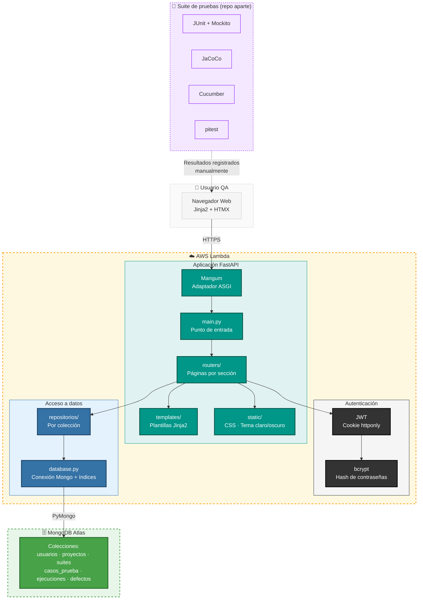

# Gestor de Casos de Prueba QA


Aplicación web para equipos de QA: organiza proyectos, suites y casos de
prueba, registra ejecuciones con su resultado, vincula defectos y mide
cobertura. Construida en Python (FastAPI) con MongoDB como única base de
datos.

Es la capa visible del proyecto insignia de QA/automatización del
portafolio. La suite de pruebas real vive en
[`pruebas-coffeemaker/`](pruebas-coffeemaker/README.md), dentro de este
mismo repositorio: JUnit, Mockito, JaCoCo, Cucumber y mutation testing
(pitest) sobre el dominio CoffeeMaker de la especialización de Coursera
"Introducción a las pruebas de software". Esas pruebas corren aparte (en
Eclipse o VS Code, no contra esta app); sus resultados se registran aquí
manualmente como Ejecuciones, con el reporte real (JaCoCo, surefire,
Cucumber, pitest) como evidencia — ver el flujo completo en el README de
esa carpeta.

## Demo en vivo

**Aplicación:** [immxew65sfxj7nubwzlszdimfi0qegzc.lambda-url.us-east-1.on.aws](https://immxew65sfxj7nubwzlszdimfi0qegzc.lambda-url.us-east-1.on.aws/)

## Qué hace

- Registro e inicio de sesión con contraseña cifrada
- Roles QA: cualquier cuenta QA crea y edita
- Proyectos, Suites de prueba y Casos de prueba, organizados jerárquicamente
- Ejecuciones de un caso con resultado (Passed / Failed / Blocked / Skipped)
- Defectos vinculados a una ejecución fallida, con severidad y estado
- Panel de cobertura y resultados por proyecto y suite

## Con qué está hecho

| Capa | Tecnología |
|---|---|
| Servidor | FastAPI, Uvicorn |
| Interfaz | Jinja2, HTMX |
| Base de datos | MongoDB |
| Sesiones | JWT en cookie httponly |
| Contraseñas | bcrypt |

## Estructura

```
.
├── backend/                  Aplicación web (FastAPI + MongoDB) — detalle abajo
├── pruebas-coffeemaker/      Suite de automatización QA (JUnit, Mockito,
│                             JaCoCo, Cucumber, pitest) — README propio
├── .env.example
└── README.md                 Este archivo
```

Detalle de `backend/`:

```
backend/
├── requirements.txt
└── app/
    ├── main.py              Punto de entrada, monta rutas y estáticos
    ├── config.py            Carga del .env
    ├── database.py          Conexión a Mongo e índices
    ├── seguridad.py         Hasheo de contraseñas y sesiones (JWT)
    ├── dependencias.py      Identificación del usuario, exige login/rol
    ├── repositorios/        Acceso a datos por colección
    ├── routers/             Páginas web por sección
    ├── comandos/            Scripts de un solo uso (crear cuenta ADMIN)
    ├── templates/           Plantillas Jinja2
    └── static/               Hoja de estilos y tema claro/oscuro
```

## Diagrama de Arquitectura



## A qué se conecta

Una única base MongoDB con estas colecciones: `usuarios`, `proyectos`,
`suites`, `casos_prueba`, `ejecuciones`, `defectos`. No requiere ningún otro
servicio ni clave de API.

## Cómo ejecutarlo

Requisitos: Python 3.11+ y una base MongoDB accesible (Atlas M0 gratis
alcanza de sobra).

```bash
cd backend
python -m venv .venv
.venv\Scripts\Activate.ps1        # Windows
source .venv/bin/activate         # Linux o macOS

pip install -r requirements.txt
```

Copia `.env.example` como `.env` (en la raíz del proyecto) y completa
`MONGO_URI` y `JWT_SECRET` (genera este último con
`python -c "import secrets; print(secrets.token_urlsafe(48))"`).

```bash
cd backend
uvicorn app.main:app --reload
```

Queda en `http://127.0.0.1:8000`.

Las cuentas creadas desde `/registro` quedan con rol QA.

## Despliegue

Aplicación sin estado propio en disco (todo vive en MongoDB), así que corre
igual en cualquier hospedaje con soporte para Python. La instancia pública
corre en AWS Lambda (Function URL, sin API Gateway) mediante el adaptador
`mangum`, con MongoDB Atlas M0 como base de datos. Solo hay que definir
`MONGO_URI` y `JWT_SECRET` como variables de entorno del servicio.

## Autor

**Luis Felipe Arias Carriazo**
[GitHub](https://github.com/lariasca1994) · [LinkedIn](https://linkedin.com/in/lfac1)